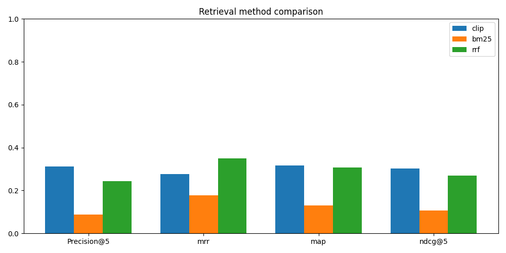

# Comic Search using NLP + CLIP


A hybrid comic book search engine that lets you search comic pages using natural language descriptions. The system extracts pages from `.cbz` and `.pdf` comic files, builds a CLIP visual embedding index, extracts OCR text, and supports three retrieval methods — CLIP semantic search, BM25 keyword search, and RRF hybrid fusion — evaluated against a golden test set using four standard IR metrics.

---

## Features

- Extract pages from comic archives (`.cbz` preferred, `.pdf` supported as fallback)
- Automatic superhero/character inference from filenames and parent folder structure
- OCR text extraction using Tesseract
- Semantic image-text retrieval using OpenCLIP (ViT-B/32)
- BM25 keyword search over extracted OCR text
- **Reciprocal Rank Fusion (RRF)** combining CLIP + BM25 results
- Evaluation using Precision@5, MRR, MAP, and NDCG@5
- Side-by-side metric comparison chart across all three methods
- Visual display of ranked search results via Matplotlib

---

## Project Pipeline

```
Comic Files (.cbz / .pdf)
        ↓
  Page Extraction
        ↓
  Image Dataset (dataset/)
        ↓
    ┌───────────────────────┐
    │  Two parallel paths:  │
    │                       │
    │  CLIP path            │  OCR path
    │  encode image         │  Tesseract OCR
    │  → 512-d vector       │  → extracted text
    │  → clip_index.npz     │  → dataset_text.json
    └───────────────────────┘
        ↓
       Search
  ┌─────────────────────────────────────┐
  │ CLIP  — visual semantic search      │
  │ BM25  — OCR keyword search          │
  │ RRF   — fusion of CLIP + BM25       │
  └─────────────────────────────────────┘
        ↓
  Evaluation (Precision@5, MRR, MAP, NDCG@5)
        ↓
  metrics_comparison.png
```

---

## Directory Structure

```
comic-search/
│
├── datasets/                 # Input comic files (.cbz / .pdf) — git ignored
├── dataset/                  # Extracted page images — git ignored
├── dataset_text.json         # OCR text corpus (generated)
├── clip_index.npz            # CLIP embedding index (generated) — git ignored
├── metrics_comparison.png    # Evaluation bar chart (generated)
├── main.py                   # All project logic
├── requirements.txt          # Python dependencies
├── .gitignore
└── README.md
```

---

## Installation

### 1. Clone the repository

```bash
git clone <repo-url>
cd comic-search
```

### 2. Install dependencies

```bash
pip install -r requirements.txt
```

### 3. Install Tesseract OCR (system dependency)

- **Ubuntu/Debian:** `sudo apt install tesseract-ocr`
- **macOS:** `brew install tesseract`
- **Windows:** Download from [UB Mannheim](https://github.com/UB-Mannheim/tesseract/wiki)

---

## Requirements

```
torch
numpy
pytesseract
open_clip
matplotlib
rank-bm25
```

> **Note:** `fitz` and `pypdf` are imported in the code but currently commented out in `requirements.txt`.
> Install `PyMuPDF` (which provides `fitz`) if you plan to use PDF extraction:
> ```
> pip install PyMuPDF
> ```

---

## Usage

> **Note:** The CLI (`argparse`) block is currently commented out in `main.py`.
> Call functions directly in the script or uncomment the CLI block at the bottom to use flags.

### Step 1 — Extract comic pages

```python
extract_all()
```

Scans `datasets/` recursively for `.cbz` and `.pdf` files, extracts pages as `.jpg` images into `dataset/`.
- `.cbz` is the preferred format; `.pdf` is supported as a fallback via PyMuPDF (`fitz`)
- First and last 3 pages are skipped per file (covers and credits)
- Each page is saved as: `{character}_page_{issue}_{index:04d}.jpg`

### Step 2 — Build CLIP image index

```python
build_index()
```

Loops over every image in `dataset/`, runs it through CLIP (ViT-B/32), L2-normalizes the 512-d embedding vector, and saves all vectors + filenames to `clip_index.npz`.

### Step 3 — Build OCR text corpus

```python
build_text_corpus()
```

Runs Tesseract OCR on every image in `dataset/`, saves extracted text keyed by filename to `dataset_text.json`. Required before running BM25 or RRF search. Note: OCR is slow — approximately 10–20 minutes on an M3 Pro for a full dataset.

### Step 4 — Search

**CLIP semantic search** — finds pages visually matching your query:
```python
run_search("punisher fighting with wilson fisk", top_k=5, show=True)
```

**BM25 keyword search** — finds pages whose OCR text matches your query:
```python
results = bm25_search("punisher fighting with wilson fisk", top_k=5)
```

**RRF hybrid search** — fuses CLIP and BM25 rankings for best results:
```python
results = rrf_search("punisher fighting with wilson fisk", top_k=5)
```

The `show=True` flag on `run_search` displays the result pages as images using Matplotlib.

### Step 5 — Evaluate all methods

```python
clip_results = evaluate_all(run_search, k=5, mode="clip")
bm25_results = evaluate_all(bm25_search, k=5, mode="bm25")
rrf_results  = evaluate_all(rrf_search, k=5, mode="rrf")

compare(clip_results, rrf_results)
```

Runs the golden test set through each method and computes Precision@5, MRR, MAP, and NDCG@5. `compare()` prints a side-by-side delta table showing which method performs better on each metric.

### Step 6 — Generate comparison chart

```python
plot_comparison(clip_results, bm25_results, rrf_results)
```

Saves `metrics_comparison.png` — a grouped bar chart of all three methods across all four metrics.

---

## Search Methods

### CLIP Semantic Search
Uses OpenCLIP (ViT-B/32) to encode both the text query and comic page images into the same 512-dimensional embedding space. Retrieval is done by cosine similarity (dot product after L2 normalisation). Works even on pages with no dialogue — it matches the visual scene to your description.

### BM25 Text Search
Classic keyword retrieval (Okapi BM25) over the OCR-extracted text corpus. Fast and precise when the search terms appear in comic dialogue or captions. Weak on pages with little or no text.

### RRF — Reciprocal Rank Fusion
Runs both CLIP and BM25 over the top 100 results each, then combines their rankings using the formula `1 / (60 + rank)`. Pages that rank highly in both lists receive the highest fused score. This is the best-performing method in evaluation.

---

## Evaluation Metrics

All four metrics are computed by `evaluate_all()` against the golden test set:

| Metric | What it measures |
|---|---|
| **Precision@5** | Fraction of the top 5 results that belong to the expected character |
| **MRR** (Mean Reciprocal Rank) | Average of `1/rank` for the first correct result across all queries |
| **MAP** (Mean Average Precision) | Average precision computed at each rank where a correct result appears |
| **NDCG@5** (Normalized Discounted Cumulative Gain) | Measures ranking quality, penalising correct results appearing lower in the list |

### Results



| Method | Precision@5 | MRR | MAP | NDCG@5 |
|---|---|---|---|---|
| CLIP | ~0.20 | ~0.19 | ~0.21 | ~0.21 |
| BM25 | ~0.18 | ~0.26 | ~0.21 | ~0.19 |
| **RRF** | **~0.24** | **~0.30** | **~0.27** | **~0.27** |

RRF outperforms both individual methods on every metric. BM25 beats CLIP on MRR — when BM25 finds the right answer it tends to rank it higher, likely because character names appear directly in dialogue.

---

## Golden Test Set

The evaluation uses 9 hand-labelled queries (one empty placeholder pending):

| Query | Expected |
|---|---|
| Spider-Man in red and blue suit swinging | spiderman |
| Close up face of masked superhero | spiderman |
| Black symbiote monster with huge teeth and white eyes | venom |
| Dark villain with cape and supernatural powers | venom |
| Hero with adamantium claws outstretched | wolverine |
| Snowy winter forest landscape with superhero | wolverine |
| Fire explosion orange dramatic portal scene | wolverine |
| Daredevil fighting with wilson fisk | daredevil |
| Punisher fighting with bad guys | punisher |

---

## Character Map

The project infers superhero identity from the parent folder name first, then falls back to filename keyword matching:

| Keyword | Character |
|---|---|
| `venom` | venom |
| `wolverine`, `logan` | wolverine |
| `amazing`, `spider` | spiderman |
| `punisher`, `frank`, `castle` | punisher |
| `matt`, `murdock`, `daredevil`, `devil` | daredevil |

---

## Technologies Used

| Technology | Purpose |
|---|---|
| Python | Core language |
| OpenCLIP (ViT-B/32) | Semantic image-text embeddings |
| Tesseract OCR | Text extraction from comic pages |
| BM25 (`rank-bm25`) | Keyword-based text retrieval |
| RRF | Hybrid fusion of CLIP + BM25 rankings |
| PyMuPDF (`fitz`) | PDF page extraction |
| `zipfile` (stdlib) | `.cbz` archive extraction |
| NumPy | Embedding storage and cosine similarity |
| Matplotlib | Search result display and metric charts |
| Pillow | Image loading and preprocessing |

---

## Known Limitations

- The CLI (`argparse`) block is currently commented out — functions must be called directly in `main.py`
- Character inference falls back to the first word of the filename stem when no keyword matches, causing `None_page_...` filenames for unrecognised comics
- `pypdf` and `subprocess` are imported in the code but unused
- `fitz`/`PyMuPDF` is used for PDF extraction but commented out in `requirements.txt`
- The Dockerfile is currently empty
- One golden test set entry is an empty placeholder (`{"query": "", "expected": ""}`)
- OCR quality on comic art is noisy — speech bubble text extraction is imperfect

---

## Notes — Git Ignored Files

These files are excluded via `.gitignore` and must be generated locally:

```
datasets/        # place your .cbz / .pdf comics here
datasets.zip     # zip of the above
dataset/         # auto-generated by extract_all()
clip_index.npz   # auto-generated by build_index()
.env
```

---

## Future Improvements

- Re-enable and finalise the CLI (`argparse`) interface
- Fix `None_` prefix bug in character inference
- FAISS vector indexing for faster retrieval at scale
- Web UI for interactive search
- Improved OCR preprocessing (denoising, deskewing)
- Complete the Dockerfile for containerised deployment
- Expand the golden test set with more characters and edge cases
- Move evaluation functions to a separate `evaluate.py` module (import already prepared in code)

---

## Contributors

- Charles
- Dayas
- Rustam